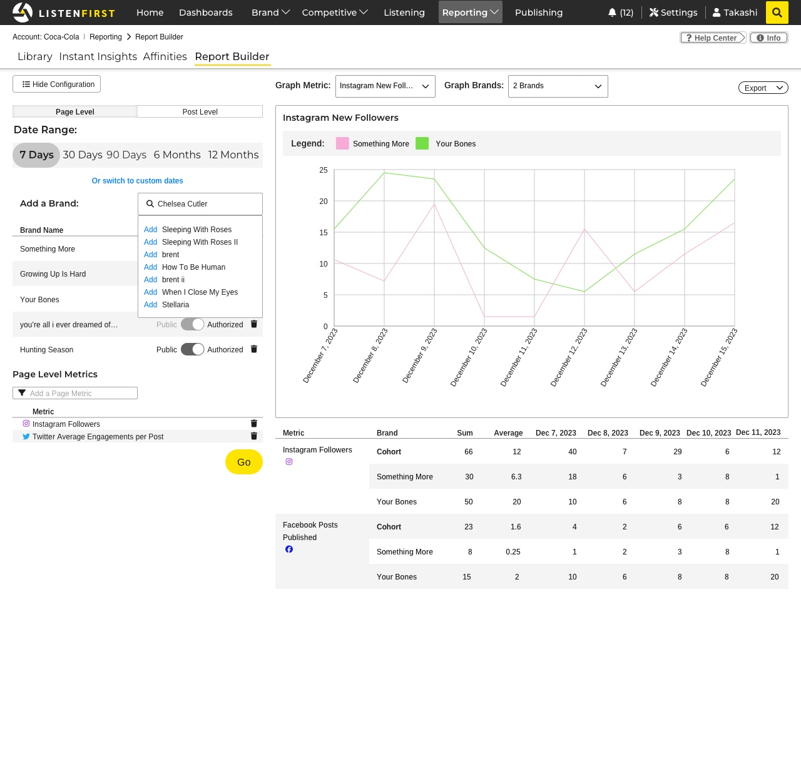
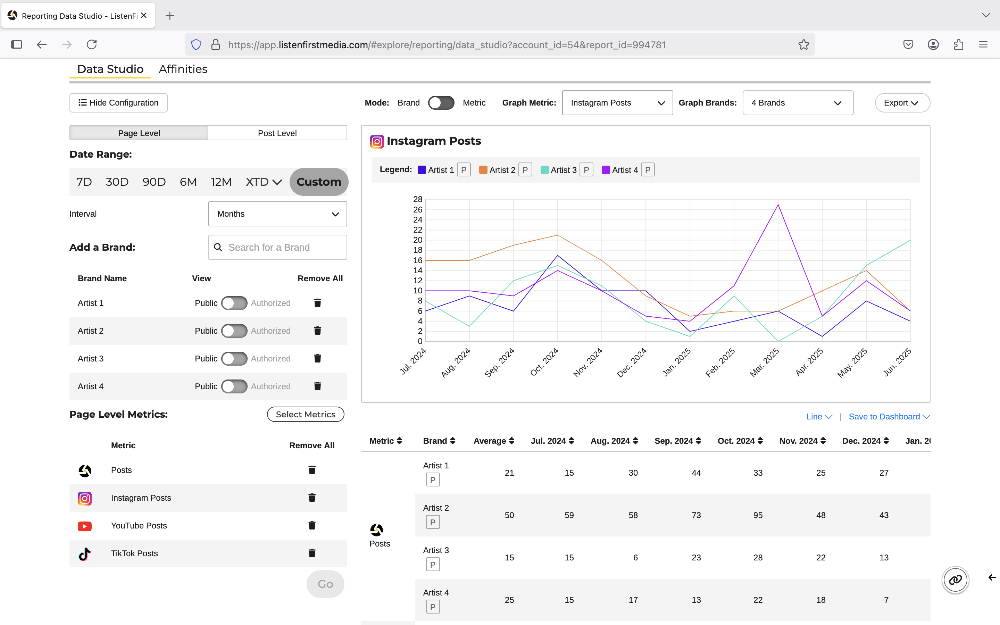
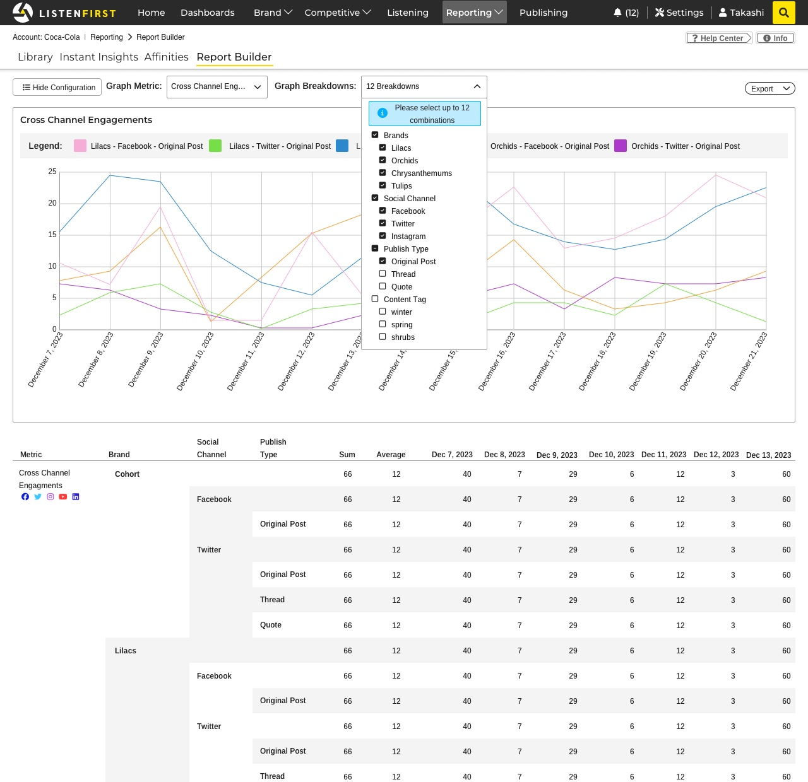
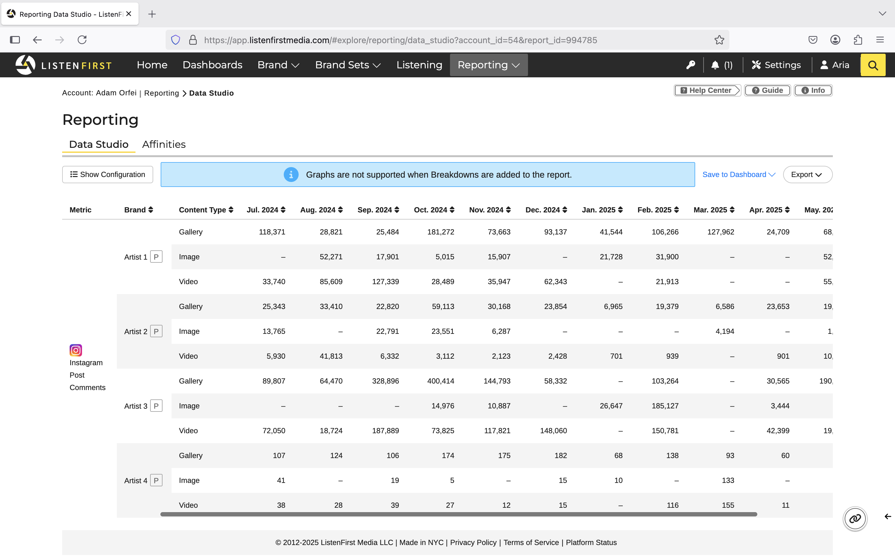

# Data Studio

## Product Design

This is a Tableau like feature that allows Users to select data to fetch, fetch that data, then see it using various visualizations. This project was unique for me in that I got to do all of the product design, system design, and code implementation for the feature.

#### A basic example

This feature was also designed to be a simple introduction to [ListenFirst's data platform](https://www.listenfirstmedia.com/proprietary-platform/), as a lot of the features are designed with power users in mind, and thus the learning curve is steep.

The 4 basic features people needed to choose were:
1. whether to look at individual social media posts or aggregate all posts
2. a date range
3. brands (an association of data sources)
4. metrics (individual or combined data points based on the data source)

It also includes a lot of sensible defaults with some of the more complex features easy to skip over until an analyst is ready.

Above is the first iteration, with the configuration people chose on the left. From here, a lot of the basic components stayed the same, with the most notable change being in the date range (with a Custom option instead of the button to [show a complex view](./design_comment_date.png) and the addition of interval) and the metric selection becoming a button instead of typeahead, along with a couple minor styling changes.

On the right (once the Go button is pressed) is the display output. This has changed much less, but mainly, there was the removal of a cohort row, and addition of the Brand/Metric toggle (which allowed someone to look at multiple metrics for one brand, or multiple brands for one metric).

  
<b>A quick aside on what page level versus post level means</b>

  While there is some overlap (that gets a bit more nuanced for differences), the overall difference is that Page Level includes metrics like follows that only exist for a page level. Similarly Post Level metrics include a lot of intuitive metrics like likes and comments counts.
  
  #### What about overlapping metrics?
  We do also have certain metrics like a Page Level like count, this might come to a different number than if we were to take all the posts and add up each's like count. While counterintuitive, both of these metrics are useful, even when they disagree. The first main change is attribution windows (ie should we attribute a like to the day a viewer clicked like (fact), or the day when account posted the post?). By default, Data Studio groups on In-Window mode: which is to say that the post and fact must be within the specified date range. A brand level metric might group on In-Action: regardless of when the posts were posted, but just including all facts within the date range. In-Action is not feasible from a data perspective on a post level.
  The other main difference is that we might get both Page and Post Level metrics from the data provider. These numbers are not guaranteed to match either (but at this point it's out of our control), but also certain data providers will give us additional breakdowns on a Page Level that they do not provide at a Post Level.

#### Breakdowns

While the above is the basic case, where we want a new client to be able to use the feature without being overwhelmed, we also want to support more complex use cases as users grow. Below is the Breakdowns feature in design, which allowed disaggregation on certain dimensions. The main concern with Breakdowns is that while it adds a lot of power and works beautifully in rowspanned columns, the graph is a bit of a mess. The legend names become very long, and trying to select a breakdown becomes an unruly list with too many nested options.

Thus what happened in the final implementation was a dropping of graphs to minimize complexity. While potentially it's easier to visualize than look at numbers, the additional confusion it would've caused did not warrant the complexity it brought. We have sticky grouping columns (ie the Breakdowns, in addition to metric and Brand as default) and an export feature such that an analyst can pop the data into another program to build those graphs to their heart's content without the restrictions placed to ensure usability.

---

## Engineering

While the above is all a product rationale we made to keep the feature usable and powerful, it doesn't really go into the engineering of it all.

On an API front, there was a minimal amount of work, as I just had to add the configuration to display this page when navigating to the URL, as well as determining which metrics to show. The API used to provide data was just reusing our existing External API. Thus this became essentially a point and click API request creation and displaying pretty visualizations from the data. This made a lot of sense because there's already a lot of stability and extensibility with the External API, and it limits our code footprint, meaning no more code to maintain. It also supports large data requests (since it is asynchronous), meaning that it could handle all of what we needed. To work seamlessly with the asynchronous architecture, I used polling for simplicity (and the limited time/bandwidth required; most requests finish within one minute).

For the frontend, where most of the development happened, all state was managed by the configuration, with just a small amount of temporal state used for the graph displays. To support that, I wrapped a reducer (written with RTK.createSlice for it's built in immutability) in a single provider, with data seeded either from sensible defaults, or from the External API job when reloading the page. This allowed me to have a single source of truth all components could pull from, and eased debugging and safety by having a single place to watch updates and make restricted changes. This also allowed me to update other pieces of the state as certain state changes caused other restrictions to apply, and this could all be done opaquely to the caller.

For the displays, I used our opinionated React component which wraps a d3 graph, such that building a graph requires just using the well defined component API, while also maintaining brand consistency. The table was a similar story; our component library has an opinionated table and well defined API that has styling already applied. However, because rowspans are rarely used on our platform, our Table component does not define strong support for them. To get around this limitation, I can pass custom cell components that allow me to render as needed (ie I can add a td with a rowspan attribute, or return null if a previous rowspan made this component obsolete). This made cells more complex as it required rendering with external state, but because of the infrequent use of rowspans, localizing the complexity to this component (such that it does not add complexity to the common Table component) was justifiable.
